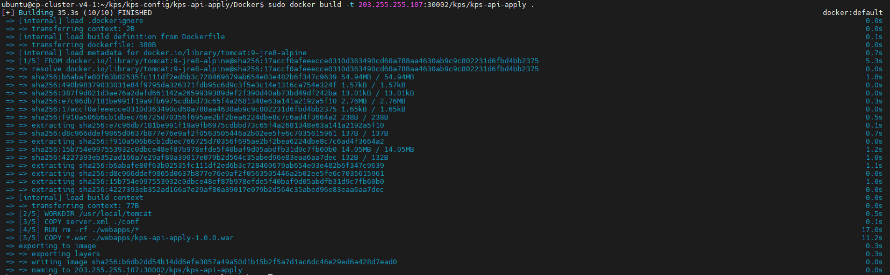
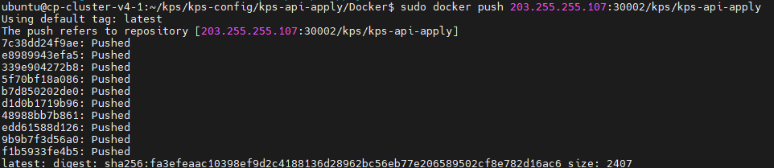
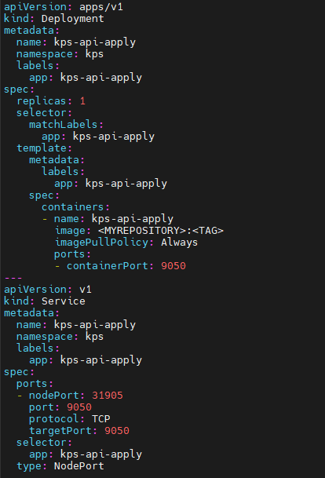
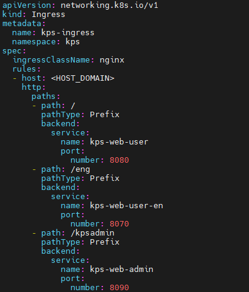
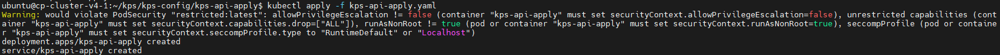
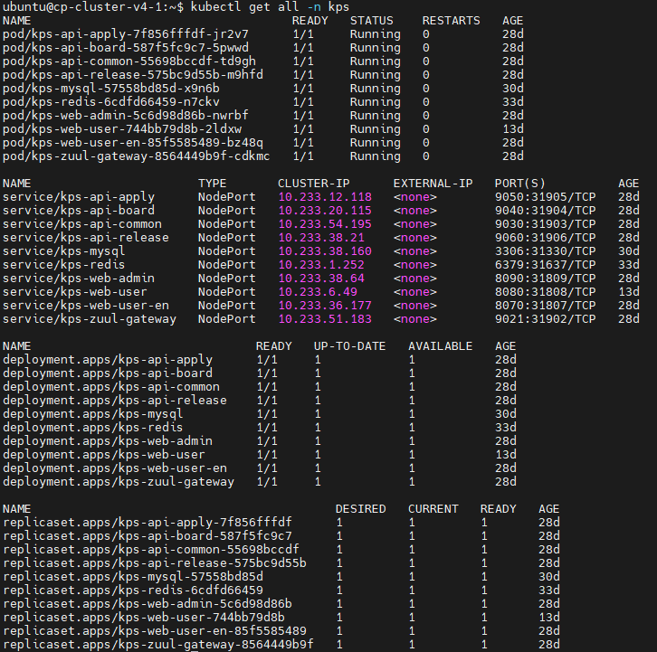

### [Index](../../README.md) > Pack

## Table of Contents

1. [개요](#1)  
 1.1. [목적](#1.1)  
 1.2. [소개](#1.2)  
 1.3. [참고 자료](#1.3)  
2. [Docker](#2)  
 2.1. [Prerequisite](#2.1)  
 2.2. [Docker 설치](#2.2)  
 2.3. [Dockerfile](#2.3)         
  2.3.1. [Dockerfile 작성법](#2.3.1)   
  2.3.2. [Server.xml 설정](#2.3.2)  
 2.4. [이미지 빌드](#2.4)  
 2.5. [생성된 이미지 푸시](#2.5)  
 2.6. [Kubernetes yaml 파일 작성](#2.6)  
  2.6.1. [yaml 파일 작성법](#2.6.1)  
  2.6.1. [K-PaaS 대표포털 어플리케이션 예시](#2.6.1)  
 2.7. [Kubernetes 배포](#2.7)  


# <div id='1'/>1.  문서 개요

## <div id='1.1'/>1.1. 목적
본 문서는 어플리케이션 플랫폼 종료에 따라 전환 가이드 제공 및 기술 지원하는 데 그 목적이 있다. Dockfile을 작성하여 이미지를 빌드하고 배포하는 과정에 대해 소개하며 모든 과정은 Linux 환경 기반으로 진행한다.
<br>

## <div id='1.2'/>1.2. 소개
도커파일을 사용해서 전통적인 방식으로 이미지를 빌드한다. 이후 생성된 이미지는 쿠버네티스를 통해 배포한다.

## <div id='1.3'/>1.3. 참고 자료

 - Docker Build Document:[https://docs.docker.com/engine/reference/commandline/build/](https://docs.docker.com/engine/reference/commandline/build/)
<br>
 - Docker Document:
[https://docs.docker.com](https://docs.docker.com)


  
<br><br>

# <div id='2'/>2. Dockerfile 이미지 생성
## <div id='2.1'/>2.1. Prerequisite

- Docker를 설치한다.
- MSA 구조에서는 이미지 빌드시 spring 프로젝트는 Dockerfile, war/jar파일, server.xml이 필요하다.
- MSA 구조에서는  이미지 빌드시 spring boot 프로젝트는 Dockerfile, war/jar파일, application.yaml이 필요하다.

## <div id='2.2'/>2.2. Docker 설치
- Docker 설치 참고 [https://docs.docker.com/engine/install/ubuntu/](https://docs.docker.com/engine/install/ubuntu/)

```
$ sudo apt-get update
$ sudo apt-get install apt-transport-https ca-certificates curl gnupg-agent software-properties-common
$ curl -fsSL https://download.docker.com/linux/ubuntu/gpg | sudo apt-key add -
$ sudo add-apt-repository "deb [arch=amd64] https://download.docker.com/linux/ubuntu $(lsb_release -cs) stable"
$ sudo apt-get update
$ sudo apt-get install docker-ce docker-ce-cli containerd.io
$ sudo systemctl status docker
```

## <div id='2.3'/>2.3. Dockerfile 생성
### <div id='2.3.1'/>2.3.1. Dockerfile 작성법
- K-PaaS 대표포털은 아파치 톰캣 9.0 환경에서 동작하며 각 어플리케이션이 동작하는데 필요한 베이스 이미지를 넣어준다. 
- ENV명령어에 각 어플리케이션이 동작하는데 필요한 환경변수를 넣어준다.
```
FROM tomcat:9-jre8-alpine  # 사용할 베이스 이미지를 지정한다
WORKDIR /usr/local/tomcat  # 사용할 디렉토리 고정
COPY server.xml ./conf     # 고정해둔 디렉토리에 있는 server.xml을 복사
RUN rm -rf ./webapps/*     # 기본으로 있는 ROOT를 지움
ARG JAR_FILE=*.war         # 현재 디렉토리에 있는 war파일을 변수에 담아둔다
COPY ${JAR_FILE} ./webapps/kps-api-apply-1.0.0.war   # 고정해둔 디렉토리에 war파일을 복사 
ENV JAVA_OPTS="-Djava.security.egd=file:///dev/urandom -Dspring.profiles.active=prd"  # 어플리케이션 실행에 필요한 자바 런타임 환경변수를 추가한다

EXPOSE 9050                # 컨테이너 외부로 개방할 포트 번호
```

<br>

### <div id='2.3.2'/>2.3.2. Server.xml 설정
- server.xml은 톰캣이 실행시 필요한 정보를 정의한 파일이다. 각 어플리케이션이 실행하는데 필요한 설정에 맞게 값을 추가하거나 변경한다.
- 아래 예시는 kps-web-user-en 어플리케이션의 server.xml 설정값 일부다. 
```
...
<Host appBase="webapps" autoDeploy="true" name="localhost" unpackWARs="true">
<Context docBase="kps-web-user-en-1.0.0" path="/eng"  reloadable="true">

# appBase와 docBase를 변경하지 않으면 webapps/ROOT가 기본 경로가 된다.
```

<br>

## <div id='2.4'/>2.4. 이미지 빌드
- Dockerfile 빌드시 압축파일(jar, war) 위치에서 실행 또는 경로를 찾아 빌드한다.
```
$ docker build -t [IMAGE_NAME] [MY_REPOSITORY]:[TAG] .
```
<kbd>
  
</kbd>
<br>

## <div id='2.5'/>2.5. 생성된 이미지 푸시
- Docker 명령어를 통해 이미지 저장소에 pack으로 빌드한 이미지를 푸시해준다. 
```
$ docker push [MY_REPOSITORY]:[TAG]
```
<kbd>
  
</kbd>
<br>

## <div id='2.6'/>2.6. Kubernetes yaml 파일 작성
- Kubernetes Yaml 파일을 작성하여 이미지를 배포한다.
```
apiVersion: apps/v1
kind: Deployment
metadata:
  name: [DEPLOYMENT_NAME]                     #배포시 사용할 디플로이먼트 이름
  namespace: [NAMESPACE_NAME]                 #네임스페이스 이름
  labels: 
    [LABEL_KEY]: [LABEL_VALUE]               #사용할 라벨 지정(key, value)
spec:
  replicas: [REPLICAS]                        #레플리카 개수
  selector:
    matchLabels:
      [LABEL_KEY]: [LABEL_VALUE]            #사용할 라벨 지정(key, value)
  template:
    metadata:
      labels:
        [LABEL_KEY]: [LABEL_VALUE]           #사용할 라벨 지정(key, value)
    spec:
      containers:
      - name: [CONTAINER_NAME]                #Pod에 배포될 컨테이너 이름
        image: [IMAGE_REPOSITORY_URL]         #이미지 레파지토리 주소
        imagePullPolicy: Always
        env:
        - name: [ENV_NAME]                    #환경변수 이름
          value: [ENV_VALUE]                  #환경변수 value
        ports:
        - containerPort: [CONTAINER_PORT]     #컨테이너 포트 번호
---
apiVersion: v1
kind: Service
metadata:
  name: [SERVICE_NAME]                        #배포시 사용할 서비스 이름
  namespace: [NAMESPACE_NAME]                 #네임스페이스 이름
  labels:
    [LABEL_KEY]: [LABEL_VALUE]                #사용할 라벨 지정(key, value)
spec:
  ports:
  - nodePort: [NODE_PORT]                     #노드 포트 번호
    port: [PORT]                              #서비스 붙힐 컨테이너 포트번호
    protocol: TCP
    targetPort: [TARGET_PORT]                 #서비스 붙힐 컨테이너 포트번호
  selector:
    [LABEL_KEY]: [LABEL_VALUE]                #사용할 라벨 지정(key, value) 
  type: NodePort
```
<kbd>
  
</kbd>
<br>

## <div id='2.7'/>2.7. http/s 엑세스
- Kubernetes ingress를 사용하기 위해서는 NGINX Ingress Controller가 설치 되어야한다.
- Kubernetes ingress를 작성하여 host domain으로 접근 가능하게 배포를 한다.
```
apiVersion: networking.k8s.io/v1
kind: Ingress
metadata:
  name: [INGRESS_NAME]                     #배포시 사용할 인그레스 이름
  namespace: [NAMESPACE_NAME]              #네임스페이스 이름
spec:
  ingressClassName: nginx
  rules:
  - host: [HOST_DOMAIN]                     #호스트 도메인
    http:
      paths:
      - path: /                             #path 지정
        pathType: Prefix
        backend:
          service:        
            name: [SERVICE_NAME]            #접근 서비스 이름
            port:
              number: [CONTAINER_PORT]      #접근 서비스 컨테이너 번호
```
<kbd>
  
</kbd>
<br>

## <div id='2.8'/>2.8. Kubernetes 배포
- Kubernetes 배포시 작성해둔 yaml파일 위치에서 실행 또는 경로를 찾아 배포한다.
- DATABASE 배포시 기존 DB 파일은 반드시 백업하여 새로 배포한 DB에 다시 DATA를 입력한다.
```
$ kubectl apply -f [YAML_FILE]
```
<kbd>
  
</kbd>
<br>

## <div id='2.9'/>2.9. Kubernetes 조회
- Kubernetes 리소스를 조회한다.
```
$ kubectl get all -n [NAMESPACE_NAME]
```
<kbd>
  
</kbd>
<br>

### [Index](../../README.md) > Pack