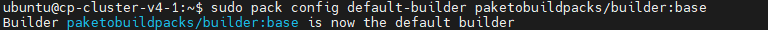
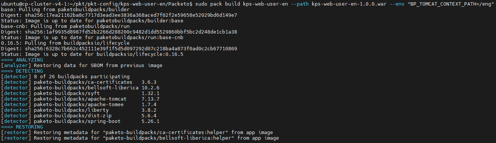
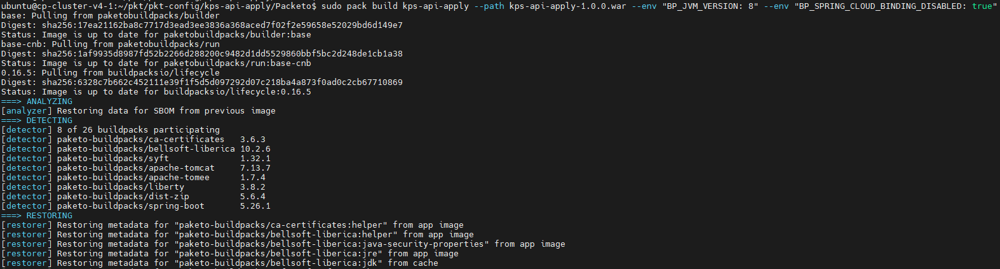
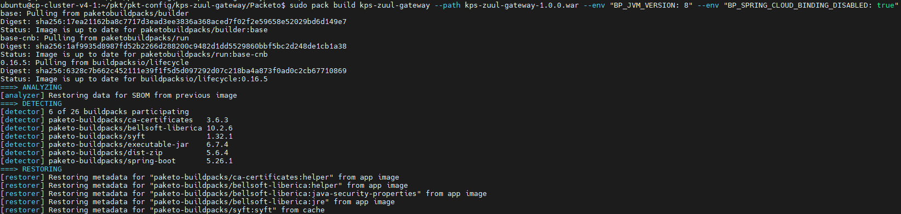
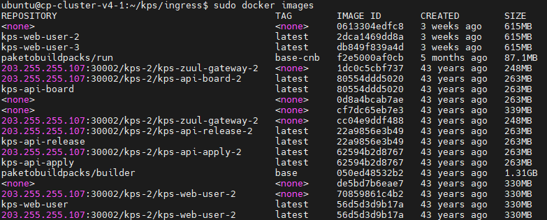
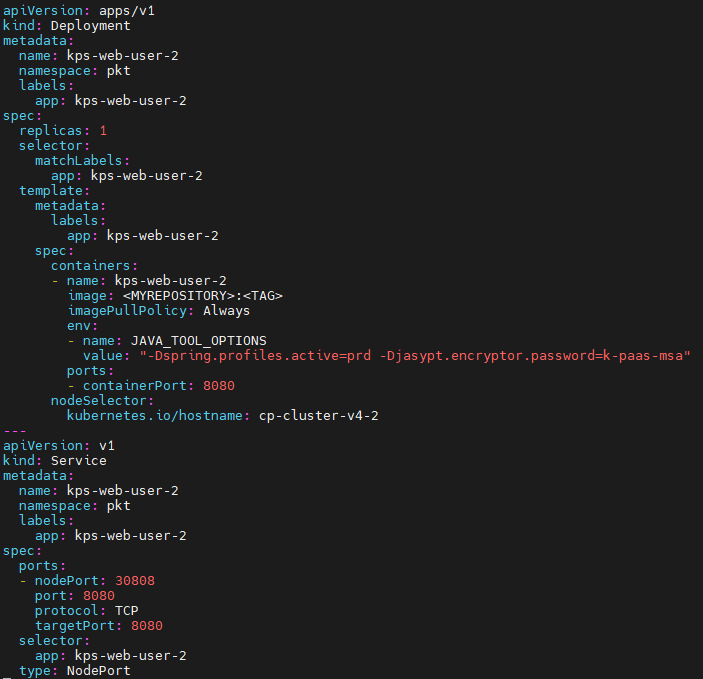
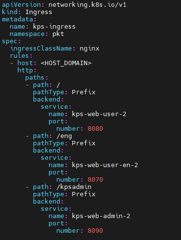
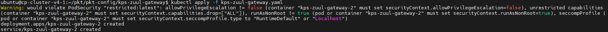
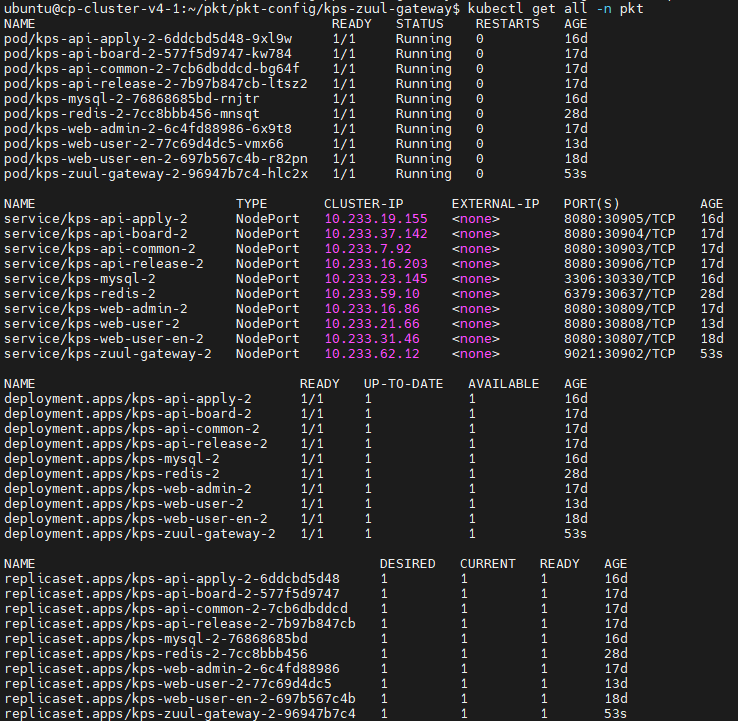

### [Index](../../README.md) > Pack

## Table of Contents

1. [개요](#1)  
 1.1. [목적](#1.1)  
 1.2. [소개](#1.2)  
 1.3. [참고 자료](#1.3)  
2. [Paketo Buildpacks](#2)  
 2.1. [Prerequisite](#2.1)  
 2.2. [Docker 설치](#2.2)  
 2.3. [Pack CLI 설치](#2.3)  
 2.4. [JAVA 설치](#2.4)  
 2.5. [Paketo Base Builder 설정](#2.5)  
 2.6. [Pack 빌드](#2.6)  
　2.6.1. [Front Application 빌드](#2.6.1)    
　2.6.2. [Back Application 빌드](#2.6.2)  
　2.6.3. [API Gateway Application 빌드](#2.6.3)  
3. [Docker](#3)  
 3.1. [이미지 조회](#3.1)  
 3.2. [이미지 태그](#3.2)  
 3.3. [이미지 푸시](#3.3)  
4. [Kubernetes](#4)  
 4.1. [Kubernetes yaml 파일 작성](#4.1)  
 4.2. [http/s 엑세스](#4.2)  
 4.3. [Kubernetes 배포](#4.3)  
 4.4. [Kubernetes 조회](#4.4)  
 


# <div id='1'/>1. 문서 개요
## <div id='1.1'/>1.1. 목적
본 문서는 어플리케이션 플랫폼 종료에 따라 전환 가이드 제공 및 기술 지원하는 데 그 목적이 있다. 어플리케이션 플랫폼을 Paketo Buildpacks을 활용하여 이미지를 빌드하고 배포하는 과정에 대해 소개하며 모든 과정은 Linux 환경 기반으로 진행한다.

<br>

## <div id='1.2'/>1.2. 소개
- buildpack은 두단계로 작동한다.
  + 감지단계 (The detect phase)
    > 빌드팩이 소스 코드를 분석하여 코드에 적합하다고 판단되는 빌드팩 그룹이 선택 되는 단계이며 이미지 생성에 필요한 계약을 반환하고 build phase 진행
  + 빌드단계 (The build phase)
    > build phase은 코드베이스를 변환하고 빌드 시간 및 런타임 환경을 제공, 필요한 종속성 다운로드, 필요한 경우 코드 컴파일 및 진입점과 시작 스크립트를 설정
- builders
  + 컨테이너 이미지를 빌드하는 데 필요한 구성요소
  + 코드를 분석하고 앱 빌드 및 실행을 위한 계획을 제공하는 실행 파일 세트(빌드팩)
  + 스택은 빌드 이미지와 실행 이미지라는 두 가지 이미지로 구성
    - 빌드 이미지는 빌드 환경(빌드팩이 실행되는 컨테이너화된 환경)을 제공 
    - 실행 이미지는 런타임 중에 애플리케이션 이미지에 대한 환경을 제공
  + Lifecycle은 빌드팩 실행을 관리하고 결과 아티팩트를 최종 이미지로 조합
  + 하나의 빌더가 다양한 애플리케이션을 자동으로 감지하고 빌드
- 다양한 JVM 제공
  + Paketo 빌드팩은 기본적으로 Liberica JVM을 사용, Liberica는 주요 OpenJDK 기여자가 지원하고 Spring에서 권장하는 HotSpot 기반 Java 런타임

<br>

## <div id='1.3'/>1.3. 참고 자료
본 문서는 Paketo Buildpacks를 참고로 작성하였다.<br>
 - Paketo Buildpacks Document: [https://paketo.io](https://paketo.io)<br> 
 - Paketo Buildpacks Java Build Document:
[https://paketo.io/docs/howto/java](https://paketo.io/docs/howto/java)<br>
 - Docker Document:
[https://docs.docker.com](https://docs.docker.com)

  
<br><br>

# <div id='2'/>2. Paketo Buildpacks
## <div id='2.1'/>2.1. Prerequisite
- 환경 구축으로는 Docker, Java, Pack CLI를 설치한다.
- pack 빌드시 압축 파일(War, Jar)이 필요하다.

## <div id='2.2'/>2.2. Docker 설치
- Docker 설치 참고 [https://docs.docker.com/engine/install/ubuntu/](https://docs.docker.com/engine/install/ubuntu/)

## <div id='2.3'/>2.3. Pack CLI 설치
- Pack 설치 참고 [https://buildpacks.io/docs/tools/pack/](https://buildpacks.io/docs/tools/pack/)
```
$ sudo add-apt-repository ppa:cncf-buildpacks/pack-cli
$ sudo apt-get update
$ sudo apt-get install pack-cli
```
## <div id='2.4'/>2.4. JAVA 설치
- 가이드에서 제공하는 어플리케이션은 Java8로 개발 되었기 때문에 JDK8 버전을 설치한다.
- 빌드하고자 하는 App에 맞는 JDK 버전을 설치한다.
```
#Java 8 설치
$ sudo apt-get update 
$ sudo apt-get install openjdk-8-jdk
$ java -version
openjdk version "1.8.0_382"
OpenJDK Runtime Environment (build 1.8.0_382-8u382-ga-1~20.04.1-b05)
OpenJDK 64-Bit Server VM (build 25.382-b05, mixed mode)
```
```
# JAVA_HOME 설정 (PATH라는 환경변수에 설정)
# 설치 경로 확인
$ readlink -f $(which java)
/usr/lib/jvm/java-8-openjdk-amd64/jre/bin/java

# JAVA_HOME 등록
$ sudo vim /etc/profile​
...
  done
  unset i
fi

export JAVA_HOME=/usr/lib/jvm/java-8-openjdk-amd64   #추가
export PATH=$PATH:$JAVA_HOME/bin                     #추가 

# /etc/profile 적용
$ source /etc/profile

#JAVA_HOME 확인
$ echo $JAVA_HOME
/usr/lib/jvm/java-8-openjdk-amd64
```

<br>

## <div id='2.5'/>2.5. Paketo Base Builder 설정
- paketobuildpacks을 Base builder로 설정한다.
```
$ pack config default-builder paketobuildpacks/builder:base
Builder paketobuildpacks/builder:base is now the default builder
```
<kbd>
  
</kbd>
<br>

## <div id='2.6'/>2.6. Pack 빌드
- pack 빌드시 압축파일(jar, war) 위치에서 실행 또는 경로를 찾아 빌드한다.
- 빌드하고자 하는 App에 맞게 필요한 환경변수와 필요한 옵션 값을 추가하여 빌드해 준다.
- 참고: https://paketo.io/docs/ 
```
 $ pack build [IMAGE_NAME] --path [WAR/JAR_FILE] --env [ENVIRONMENT]
```
### <div id='2.6.1'/>2.6.1. Front Application 빌드
- 가이드에서 제공하는 어플리케이션 ksp-web-ui, ksp-web-user, ksp-web-user-en은 빌드 방식이 아래와 같이 동일하다.
<kbd>
  
</kbd>
<br>

### <div id='2.6.2'/>2.6.2. Back Application 빌드
- 가이드에서 제공하는 어플리케이션 ksp-api-apply, ksp-api-board, ksp-api-common, ksp-api-release는 빌드 방식이 아래와 같이 동일하다.
<kbd>
  
</kbd>
<br>

### <div id='2.6.3'/>2.6.3. API Gateway Application 빌드
```
$ pack build kps-zuul-gateway --path kps-zuul-gateway-1.0.0.war --env "BP_JVM_VERSION: 8" --env "BP_SPRING_CLOUD_BINDINGS_DISABLED: true" 
```
<kbd>
  
</kbd>
<br>


# <div id='3'/>3. Docker
## <div id='3.1'/>3.1. 이미지 조회
- pack 빌드를 하게되면 Docker 이미지로 생성된다. Docker 이미지 조회 명령어를 통해 이미지가 잘 생성 되었는지 조회한다.
```
$ docker images
```
## <div id='3.2'/>3.2. 이미지 태그
- 생성된 이미지에 태그를 추가한다.
```
$ docker image tag [IMAGE_NAME] [MY_REPOSITORY]:[TAG]
```
<kbd>
  
</kbd>
<br>

## <div id='3.3'/>3.3. 이미지 푸시
- Docker 명령어를 통해 이미지 저장소에 pack으로 빌드한 이미지를 푸시한다.
```
$ docker push [MY_REPOSITORY]:[TAG]
```

<br><br>
# <div id='4'/>4. Kubernetes
## <div id='4.1'/>4.1. Kubernetes yaml 파일 작성
- Kubernetes Yaml 파일을 작성하여 이미지를 배포한다.
```
apiVersion: apps/v1
kind: Deployment
metadata:
  name: [DEPLOYMENT_NAME]                     #배포시 사용할 디플로이먼트 이름
  namespace: [NAMESPACE_NAME]                 #네임스페이스 이름
  labels: 
    [LABEL_KEY]: [LABEL_VALUE]               #사용할 라벨 지정(key, value)
spec:
  replicas: [REPLICAS]                        #레플리카 개수
  selector:
    matchLabels:
      [LABEL_KEY]: [LABEL_VALUE]            #사용할 라벨 지정(key, value)
  template:
    metadata:
      labels:
        [LABEL_KEY]: [LABEL_VALUE]           #사용할 라벨 지정(key, value)
    spec:
      containers:
      - name: [CONTAINER_NAME]                #Pod에 배포될 컨테이너 이름
        image: [IMAGE_REPOSITORY_URL]         #이미지 레파지토리 주소
        imagePullPolicy: Always
        env:
        - name: [ENV_NAME]                    #환경변수 이름
          value: [ENV_VALUE]                  #환경변수 value
        ports:
        - containerPort: [CONTAINER_PORT]     #컨테이너 포트 번호
---
apiVersion: v1
kind: Service
metadata:
  name: [SERVICE_NAME]                        #배포시 사용할 서비스 이름
  namespace: [NAMESPACE_NAME]                 #네임스페이스 이름
  labels:
    [LABEL_KEY]: [LABEL_VALUE]               #사용할 라벨 지정(key, value)
spec:
  ports:
  - nodePort: [NODE_PORT]                     #노드 포트 번호
    port: [PORT]                              #서비스 붙힐 컨테이너 포트번호
    protocol: TCP
    targetPort: [TARGET_PORT]                 #서비스 붙힐 컨테이너 포트번호
  selector:
    [LABEL_KEY]: [LABEL_VALUE]               #사용할 라벨 지정(key, value) 
  type: NodePort
```
<kbd>
  
</kbd>
<br>

## <div id='4.2'/>4.2. http/s 엑세스
- Kubernetes ingress를 사용하기 위해서는 NGINX Ingress Controller가 설치 되어야한다.
- Kubernetes ingress를 작성하여 host domain으로 접근 가능하게 배포를 한다.
```
apiVersion: networking.k8s.io/v1
kind: Ingress
metadata:
  name: [INGRESS_NAME]                     #배포시 사용할 인그레스 이름
  namespace: [NAMESPACE_NAME]              #네임스페이스 이름
spec:
  ingressClassName: nginx
  rules:
  - host: [HOST_DOMAIN]                     #호스트 도메인
    http:
      paths:
      - path: /                             #path 지정 
        pathType: Prefix
        backend:
          service:        
            name: [SERVICE_NAME]            #접근 서비스 이름
            port:
              number: [CONTAINER_PORT]      #접근 서비스 컨테이너 번호
```
<kbd>
  
</kbd>
<br>

## <div id='4.3'/>4.3. Kubernetes 배포
- Kubernetes 배포시 작성해둔 yaml파일 위치에서 실행 또는 경로를 찾아 배포한다.
- DATABASE 배포시 기존 DB 파일은 반드시 백업하여 새로 배포한 DB에 다시 DATA를 입력한다.
```
$ kubectl apply -f [YAML_FILE]
```
<kbd>
  
</kbd>
<br>

## <div id='4.4'/>4.4. Kubernetes 조회
- Kubernetes 리소스를 조회한다.
```
$ kubectl get all -n [NAMESPACE_NAME]
```
<kbd>
  
</kbd>
<br>

### [Index](../../README.md) > Pack

